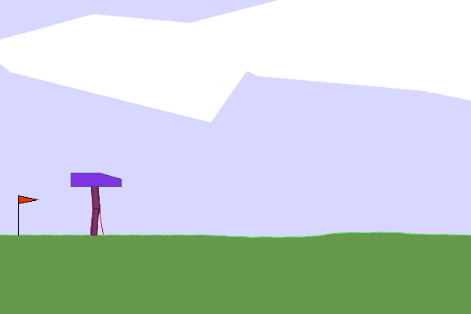
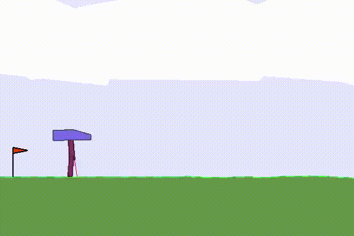

[![MIT License][license-shield]][license-url]
[![LinkedIn][linkedin-shield]][linkedin-url]

# <b>Bipedal Walker</b>

<!-- PROJECT DETAILS -->
 

  

     
    <a href="https://github.com/pricoptudor/ATNN_PricopTudor/FinalProject/blob/main/ATNN%20-%20final.pdf"><strong>Explore the documentation »</strong></a>
     
    <a href="https://prezi.com/view/Bzw4hX0gAgllLSpuzYu7/"><strong>Explore the presentation »</strong></a>  
     
     
  

 

 

<!-- TABLE OF CONTENTS -->

  
Contents

  <ol>
    <li><a href="#description">Description</a></li>
    <li><a href="#action-space">Action Space</a></li>
    <li><a href="#observation-space">Observation Space</a></li>
    <li><a href="#rewards">Rewards</a></li>
    <li><a href="#starting-state">Starting State</a></li>
    <li><a href="#episode-termination">Episode Termination</a></li>
    <li><a href="#results">Results</a></li>
    <li><a href="#contact">Contact</a></li>
  </ol>
   

 

This environment is part of the Box2D environments.
Information about the environment:

| &nbsp;     |            |
|------------|------------|
| <b>Action Space</b>  | 	Box(-1.0, 1.0, (4,), float32)    |
| <b>Observation Space</b>  | Box([-3.1415927 -5. -5. -5. -3.1415927 -5. -3.1415927 -5. -0. -3.1415927 -5. -3.1415927 -5. -0. -1. -1. -1. -1. -1. -1. -1. -1. -1. -1. ], [3.1415927 5. 5. 5. 3.1415927 5. 3.1415927 5. 5. 3.1415927 5. 3.1415927 5. 5. 1. 1. 1. 1. 1. 1. 1. 1. 1. 1. ], (24,), float32)     |
| <b>Import</b>  | gymnasium.make("BipedalWalker-v3")     |

 

## Description

 

This is a simple 4-joint walker robot environment. There are two versions:
+ <b>Normal</b>, with slightly uneven terrain.
+ <b>Hardcore</b>, with ladders, stumps, pitfalls.

To solve the normal version, you need to get 300 points in 1600 time steps. 

To solve the hardcore version, you need 300 points in 2000 time steps.

(<a href="#readme-top">back to top</a>)

  

## Action Space

 

Actions are motor speed values in the [-1, 1] range for each of the 4 joints at both hips and knees.

(<a href="#readme-top">back to top</a>)

 

## Observation Space

 

State consists of hull angle speed, angular velocity, horizontal speed, vertical speed, position of joints and joints angular speed, legs contact with ground, and 10 lidar rangefinder measurements. There are no coordinates in the state vector.

(<a href="#readme-top">back to top</a>)

 

## Rewards

 

Reward is given for moving forward, totaling 300+ points up to the far end. If the robot falls, it gets -100. Applying motor torque costs a small amount of points. A more optimal agent will get a better score.

(<a href="#readme-top">back to top</a>)

 

## Starting State

 

The walker starts standing at the left end of the terrain with the hull horizontal, and both legs in the same position with a slight knee angle.

(<a href="#readme-top">back to top</a>)

  

## Episode Termination

 

The episode will terminate if the hull gets in contact with the ground or if the walker exceeds the right end of the terrain length.

(<a href="#readme-top">back to top</a>)

 

## Results

 

(<a href="#readme-top">back to top</a>)

 
 

<!-- CONTACT -->
## Contact

Pricop Tudor-Constantin - pricoptudor2001@gmail.com

Github: [Profile page](https://github.com/pricoptudor)

 

(<a href="#readme-top">back to top</a>)

<!-- LICENSE -->
## License

Distributed under the MIT License. See `LICENSE` for more information.

<!-- MARKDOWN LINKS & IMAGES -->
[license-shield]: https://img.shields.io/github/license/pricoptudor/ATNN_PricopTudor/FinalProject.svg?style=for-the-badge
[license-url]: https://github.com/pricoptudor/ATNN_PricopTudor/FinalProject/blob/main/LICENSE
[linkedin-shield]: https://img.shields.io/badge/-LinkedIn-black.svg?style=for-the-badge&logo=linkedin&colorB=555
[linkedin-url]: https://www.linkedin.com/in/tudorc-pricop/